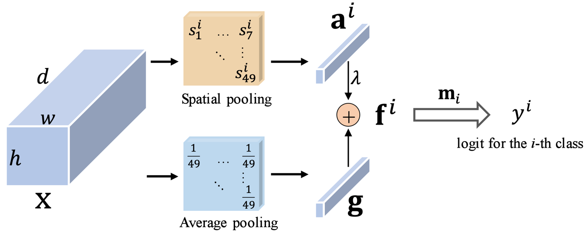

# [External-Attention-tensorflow](https://github.com/ccfco-Ivan/External-Attention-tensorflow)


### 1. Residual Attention Usage
#### 1.1. Paper
[Residual Attention: A Simple but Effective Method for Multi-Label Recognition---ICCV2021](https://arxiv.org/abs/2108.02456)

#### 1.2 Overview


#### 1.3. UsageCode
```python
from attention.ResidualAttention import ResidualAttention
import tensorflow as tf

input = tf.random.normal(shape=(50, 7, 7, 512))
resatt = ResidualAttention(num_class=1000, la=0.2)
output = resatt(input)
print(output.shape)
```

***

### 2. External Attention Usage
#### 2.1. Paper
["Beyond Self-attention: External Attention using Two Linear Layers for Visual Tasks"](https://arxiv.org/abs/2105.02358)

#### 2.2. Overview


#### 2.3. UsageCode
```python
from attention.ExternalAttention import ExternalAttention
import tensorflow as tf

input = tf.random.normal(shape=(50, 49, 512))
ea = ExternalAttention(d_model=512, S=8)
output = ea(input)
print(output.shape)
```

***

### 3. Self Attention Usage
#### 3.1. Paper
["Attention Is All You Need"](https://arxiv.org/pdf/1706.03762.pdf)

#### 3.2. Overview


#### 3.3. UsageCode
```python
from attention.SelfAttention import ScaledDotProductAttention
import tensorflow as tf

input = tf.random.normal((50, 49, 512))
sa = ScaledDotProductAttention(d_model=512, d_k=512, d_v=512, h=8)
output = sa(input, input, input)
print(output.shape)
```

***

### 4. Simplified Self Attention Usage
#### 4.1. Paper
[None]()

#### 4.2. Overview


#### 4.3. UsageCode
```python
from attention.SimplifiedSelfAttention import SimplifiedScaledDotProductAttention
import tensorflow as tf

input = tf.random.normal((50, 49, 512))
ssa = SimplifiedScaledDotProductAttention(d_model=512, h=8)
output = ssa(input, input, input)
print(output.shape)
```

***

### 5. Squeeze-and-Excitation Attention Usage
#### 5.1. Paper
["Squeeze-and-Excitation Networks"](https://arxiv.org/abs/1709.01507)

#### 5.2. Overview


#### 5.3. UsageCode
```python
from attention.SEAttention import SEAttention
import tensorflow as tf

input = tf.random.normal((50, 7, 7, 512))
se = SEAttention(channel=512, reduction=8)
output = se(input)
print(output.shape)
```

***

### 6. SK Attention Usage
#### 6.1. Paper
["Selective Kernel Networks"](https://arxiv.org/pdf/1903.06586.pdf)

#### 6.2. Overview


#### 6.3. UsageCode
```python
from attention.SKAttention import SKAttention
import tensorflow as tf

input = tf.random.normal((50, 7, 7, 512))
se = SKAttention(channel=512, reduction=8)
output = se(input)
print(output.shape)
```

***

### 7. CBAM Attention Usage
#### 7.1. Paper
["CBAM: Convolutional Block Attention Module"](https://openaccess.thecvf.com/content_ECCV_2018/papers/Sanghyun_Woo_Convolutional_Block_Attention_ECCV_2018_paper.pdf)

#### 7.2. Overview


#### 7.3. Usage Code
```python
from attention.CBAM import CBAMBlock
import tensorflow as tf

input = tf.random.normal((50, 7, 7, 512))
kernel_size = input.get_shape()[1]
cbam = CBAMBlock(channel=512, reduction=16, kernel_size=kernel_size)
output = cbam(input)
print(output.shape)

```


***

参考：小马[External-Attention-pytorch](https://github.com/xmu-xiaoma666/External-Attention-pytorch)
侵权我删谢谢